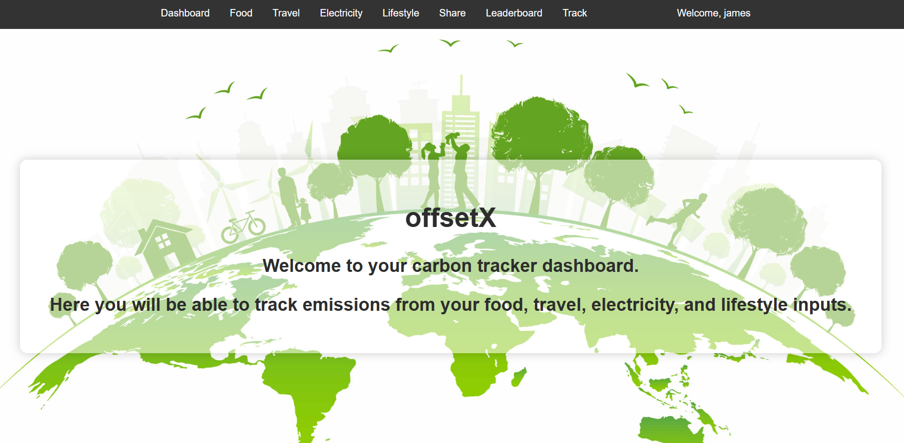
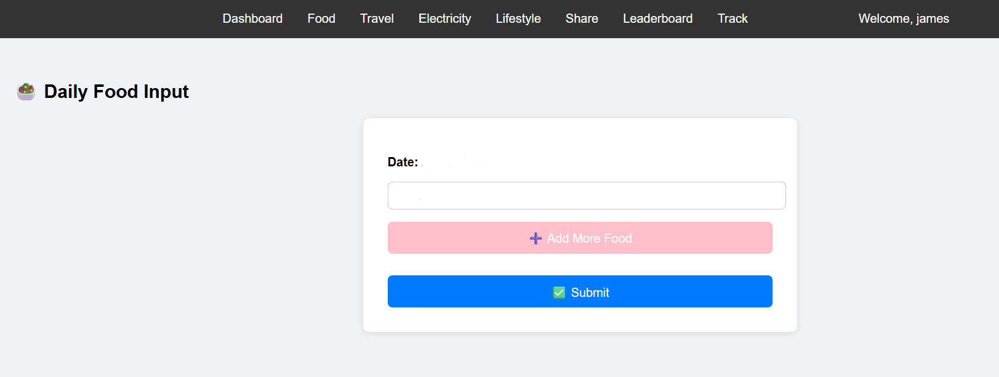
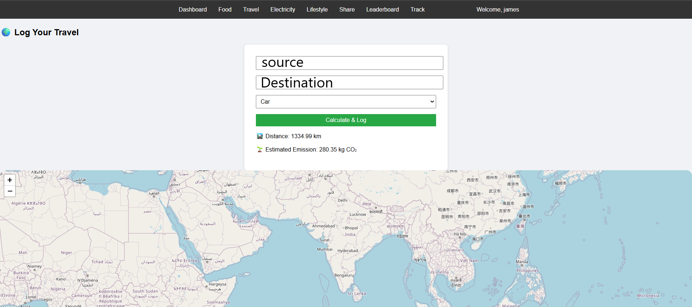
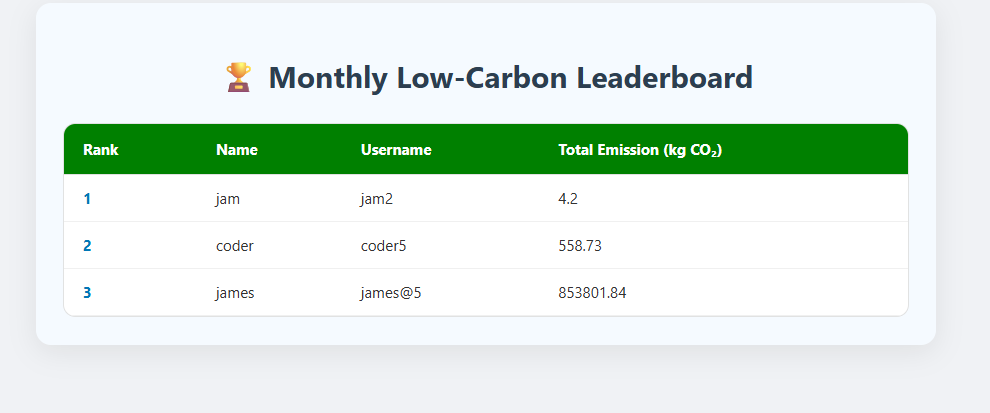
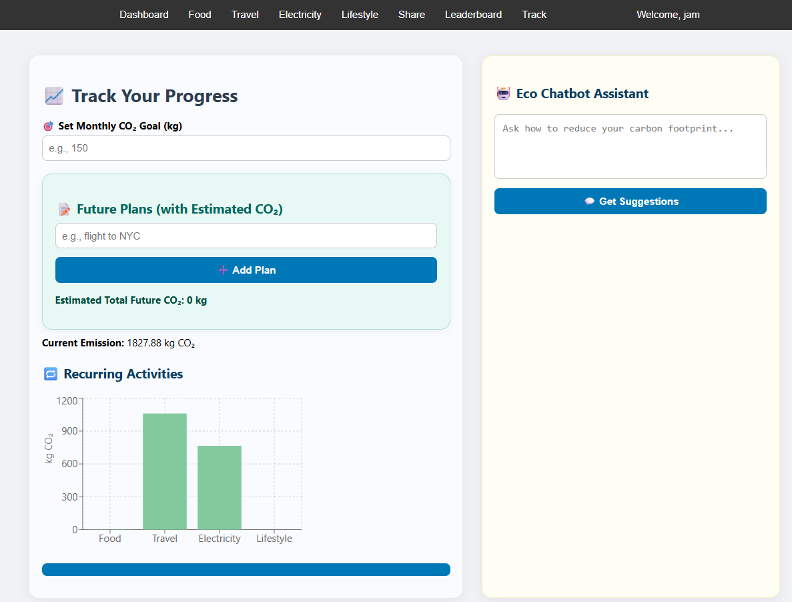

A web application designed to help users monitor and reduce their monthly carbon dioxide (CO₂) emissions. The app allows users to log daily activities related to food, travel, electricity usage, and lifestyle choices—each contributing to their overall environmental footprint. Users can also set monthly CO₂ emission goals and receive alerts if they exceed their limit, helping them stay environmentally conscious.

🚀 FEATURES :  

Real-time CO₂ Tracking: Log activities in categories like food, travel, electricity, and lifestyle.\
Interactive Graphs: Visualize monthly carbon emissions via bar charts using Recharts.\
Goal Setting & Alerts: Set a monthly emission goal and receive alerts when it's exceeded.\
AI-Powered Estimations: Estimate CO₂ output of custom activities.\
Daily Emission Tracker: Track emissions for the current day across all categories.\
leaderboard : A competitive Leaderboard feature to compare your green score with others

⚙️ Install dependencies : 

In backend directory install\
 &emsp; pip install fastapi \
 &emsp; pip install uvicorn\
 &emsp; pip install pymongo\
 &emsp; pip install python-dotenv\
 &emsp; pip install aiohttp\
 &emsp; pip install requests
 
In frontend directory install\
 &emsp; npm install

first run the backend :\
&emsp;  uvicorn main:app --reload\
then,  run the frontend : \
 &emsp; npm run dev

SCREENSHOTS : 

